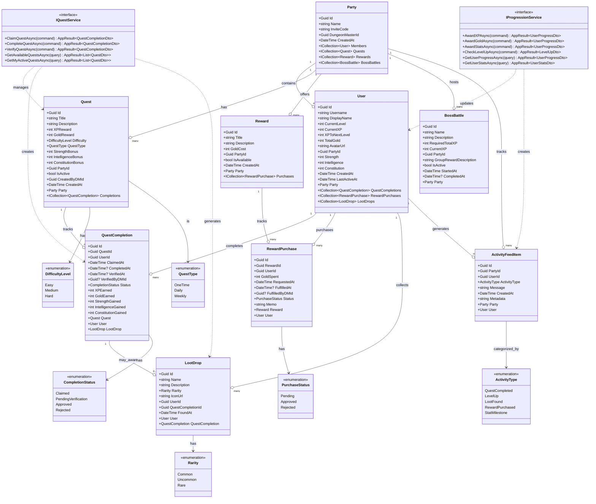

# Chore Wars - Domain Model

## Overview

This document provides a comprehensive view of the Chore Wars domain model, including all entities, services, and their relationships.

## Domain Architecture

## Entity Descriptions

### Core Entities

**Party**
- Represents a household/family group
- Contains the Dungeon Master (DM) who manages quests and approvals
- Unique invite code for joining

**User**
- Individual player in the party
- Tracks RPG stats: Level, XP, Gold, Strength, Intelligence, Constitution
- Maintains avatar and display preferences

**Quest**
- Represents a chore/task to be completed
- Awards XP, Gold, and stat bonuses
- Types: One-Time, Daily, Weekly
- Difficulty levels: Easy, Medium, Hard

**QuestCompletion**
- Tracks the completion lifecycle of a quest
- States: Claimed → Pending Verification → Approved/Rejected
- Records rewards earned (XP, Gold, Stats)
- May trigger a LootDrop (20% chance)

**Reward**
- Real-world rewards purchasable with gold
- Created by the DM (e.g., "Pick next movie", "Sleep in on Saturday")

**RewardPurchase**
- Transaction record for reward redemptions
- Requires DM approval before fulfillment

**LootDrop**
- Virtual collectible items with flavor text
- Randomly awarded on quest completion (20% chance)
- Three rarity levels: Common, Uncommon, Rare

**BossBattle**
- Collaborative party-wide goal
- Accumulates XP from all member quest completions
- Awards group reward when completed

**ActivityFeedItem**
- Event log for party activities
- Displays achievements, level-ups, and milestones

## Services

### IQuestService
Manages the quest lifecycle:
- **ClaimQuestAsync**: Player claims a quest to work on it
- **CompleteQuestAsync**: Player marks quest as done (triggers XP/Gold/Stats/Loot)
- **VerifyQuestAsync**: DM approves or rejects completion
- **GetAvailableQuestsAsync**: Lists unclaimed quests for the party
- **GetMyActiveQuestsAsync**: Lists player's claimed quests

### IProgressionService
Manages player progression and stats:
- **AwardXPAsync**: Grants experience points (may trigger level-up)
- **AwardGoldAsync**: Grants gold currency
- **AwardStatsAsync**: Increases Strength, Intelligence, or Constitution
- **CheckLevelUpAsync**: Determines if user leveled up and calculates new XP threshold
- **GetUserProgressAsync**: Retrieves current progress (level, XP, gold, stats)
- **GetUserStatsAsync**: Retrieves current stat attributes

## Key Business Rules

1. **Quest Lifecycle**: Claimed → Completed → Verified (by DM)
2. **Loot System**: 20% chance on verified quest completion
3. **Stat Attribution**:
   - Strength: Physical chores (groceries, yard work)
   - Intelligence: Mental tasks (bills, planning)
   - Constitution: Routine chores (cooking, laundry)
4. **Level Progression**: Exponential XP scaling
5. **Reward Economy**: Gold-based marketplace with DM approval required
6. **Boss Battles**: Collaborative XP pooling for group achievements

## Enumerations

- **DifficultyLevel**: Easy, Medium, Hard
- **QuestType**: OneTime, Daily, Weekly
- **CompletionStatus**: Claimed, PendingVerification, Approved, Rejected
- **PurchaseStatus**: Pending, Approved, Rejected
- **ActivityType**: QuestCompleted, LevelUp, LootFound, RewardPurchased, StatMilestone
- **Rarity**: Common, Uncommon, Rare
